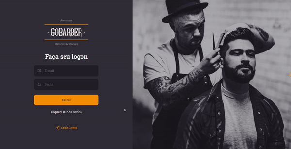
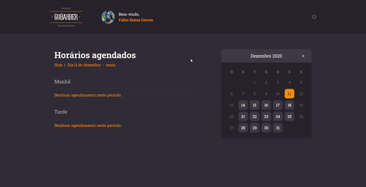

# GoBarber

*disclaimer*: This application was fully developed using the tools and help during [Rocketseat](https://rocketseat.com.br/)'s GoStack Bootcamp. You can check the more info about the course and the code learnt on it [here](https://github.com/fabiosenracorrea/Rocketseat_go_stack).

GoBarber is a full-stack application developed using [NodeJS](https://nodejs.org/en/), [React](https://reactjs.org/) and [React Native](https://reactnative.dev/).

## Content

The application is built to be a *marketplace of barbers*, in which each user can register to find and schedule sessions with other registered barbers.

You can check each part of it below:

* [Web](./web)
* [Mobile](./appgobarber)
* [Server](./server)

## Preview

### Web Preview

#### Login/Register

#### Dashboard/Profile

### Mobile Preview

#### Login/Register

#### Dashboard/Profile

